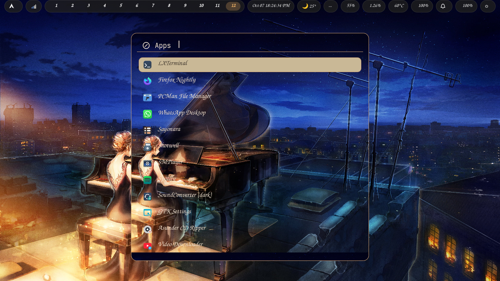
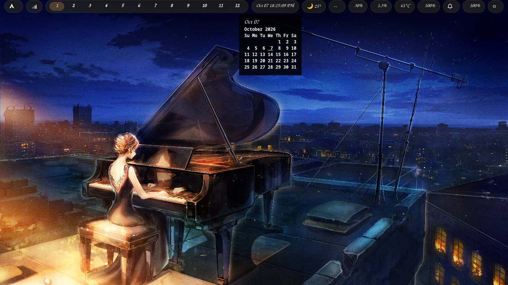
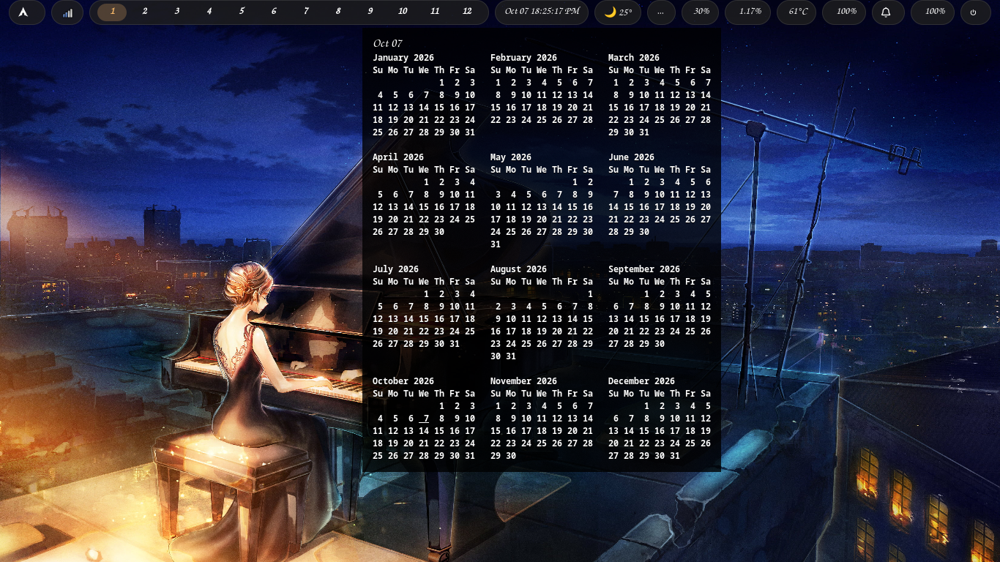
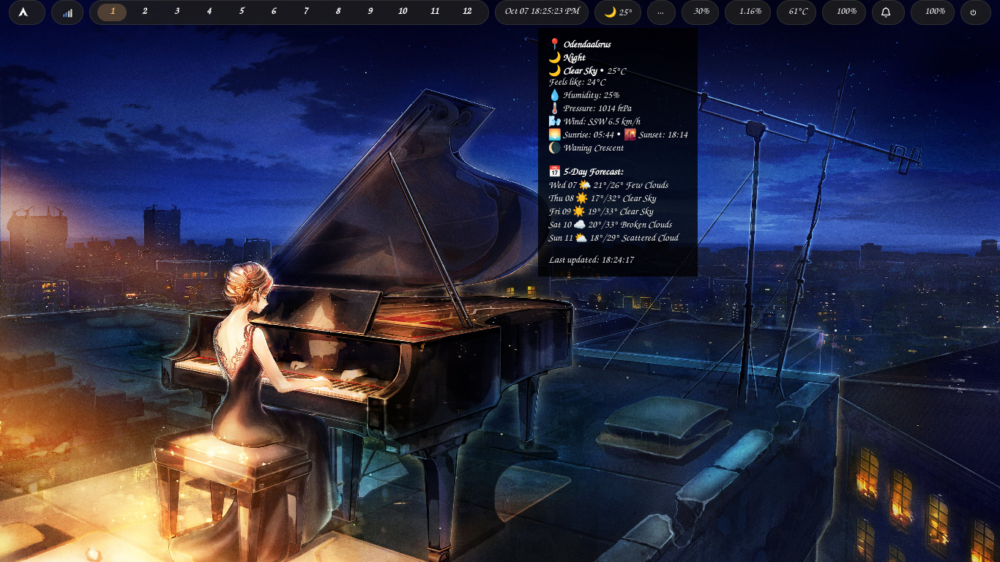
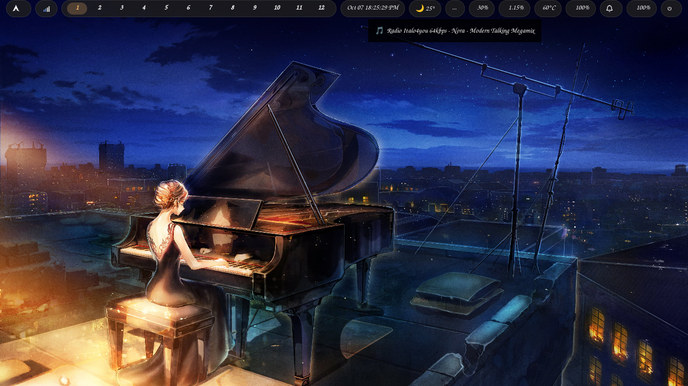

# Aro Compositor Dotfiles

<div align="center">

[](https://wgparch.codeberg.page/aro/)


<br><br>

Minimal, flat, one accent colour, spring-animated Wayland compositor.
Built on wlroots 0.20 with SceneFX for rounded corners and blur effects.

</div>

---

## ✨ Features
- **Tiling layouts:** Manual, dwindle, monocle, and scroll modes
- **12 workspaces:** Native ext-workspace-v1 support with animated pills
- **Live config:** Instant reload on save with error notifications
- **Built-in bar:** Auto-hides when Waybar or other bars are detected
- **Wallpaper picker:** `mod+w` for thumbnail browser with search
- **Window rules:** Per-application floating, tiling, and workspace assignment
- **SceneFX effects:** Rounded corners, blur, and glass headers

## 📖 Documentation & Installation

For full instructions, keybinds, and Waybar configuration, please visit the **[Official Documentation Website](https://wgparch.codeberg.page/aro/)**.

## 📸 Screenshots








## 🚀 Installation

### Arch Linux

Install `aro` using your preferred AUR helper (`paru` or `trizen`):

```bash
paru -S aro-git
# OR
trizen -S aro-git

# Clone these dotfiles
git clone https://github.com/WgpArch/dotfiles.git ~/.dotfiles
cd ~/.dotfiles/aro

# Symlink the config
ln -s ~/.dotfiles/aro/configs/aro ~/.config/aro
